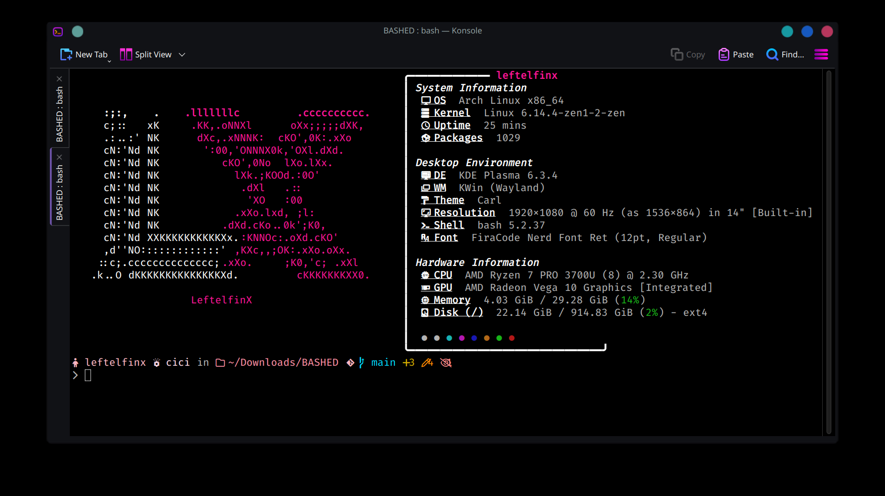

# 🚀 BASHED: The Ultimate Bash Theme & Configuration Setup



This script automates setup of a customized `.bashrc` with Nerd Font theming, dynamic prompt, and Git integration.

## ✨ Features

- **13 Nerd Font Themes** - Professionally designed terminal themes
- **Dynamic Prompt** - Shows user, host, directory, and Git status
- **Git Integration** - Real-time branch tracking with status indicators
- **Performance Metrics** - Command execution timing (>500ms)
- **Safe Installation** - Automatic backup before changes

## 🛠 Installation

```bash
# Clone repository
git clone https://github.com/yourusername/bashed-terminal.git
cd bashed-terminal
```

### Install with theme selection

```bash
./bashed.sh install # Initial Installation
```

### Other commands:

```bash
./bashed.sh reset    # Restore original config
./bashed.sh theme    # Change theme
```

## 🎨 Available Themes


## 📷 Screenshots

| Theme Example                      | Git Integration             | Command Timing                    |
| ---------------------------------- | --------------------------- | --------------------------------- |
|  |  |  |

## ⚙️ Requirements

- **Bash** 4.0+
- **Nerd Fonts** (recommended: FiraCode, Hack)
- **Git** (for full functionality)

---

**Pro Tip**: For best experience, use with terminal emulators that support Nerd Fonts like:

- Windows Terminal
- iTerm2 (macOS)
- Kitty
- Alacritty

## 📜 License

MIT Licensed - Free for personal and commercial use

---